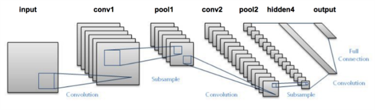

# Digit Recognizer using Deep Learning
This project is part of the Kaggle competition. You can find more details here: https://www.kaggle.com/c/digit-recognizer#evaluation. But here is an introduction before I dive in:
## Goal
The goal in this competition is to take an image of a handwritten single digit, and determine what that digit is. For every ImageId in the test set, you should predict the correct label.
## Dataset used:
MNIST ("Modified National Institute of Standards and Technology") is the de facto “hello world” dataset of computer vision. Since its release in 1999, this classic dataset of handwritten images has served as the basis for benchmarking classification algorithms. As new machine learning techniques emerge, MNIST remains a reliable resource for researchers and learners alike.
## Algorithm
### The LeNet architecture

The LeNet architecture is an excellent “first architecture” for Convolutional Neural Networks (especially when trained on the MNIST dataset, an image dataset for handwritten digit recognition). LeNet is small and easy to understand — yet large enough to provide interesting results. Furthermore, the combination of LeNet + MNIST is able to run on the CPU, making it easy for beginners to take their first step in Deep Learning and Convolutional Neural Networks. In many ways, LeNet + MNIST is the “Hello, World” equivalent of Deep Learning for image classification. The LeNet architecture consists of the following layers:
### LeNet - Convolutional Neural Network in Python
INPUT => CONV => RELU => POOL => CONV => RELU => POOL => FC => RELU => FC
Note: The original LeNet architecture used TANH activation functions rather than RELU . The reason we use RELU here is because it tends to give much better classification accuracy due to a number of nice, desirable properties.

